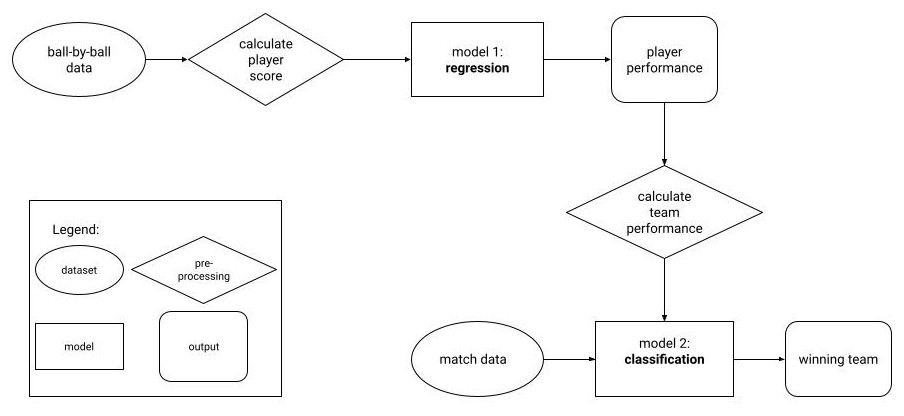

# IPL Match Analysis and Prediction
### Machine Learning Final Project Code

Work done as a part of the course CSE 343: Machine Learning by Prof. Jainendra Shukla.

## About The Project

In this project, we analysed the two IPL datasets (2008-2020): ball-by-ball data and match summary. The ball-by-ball data has information on various deliveries in different matches, including data on player performance and match summary includes non-performance data like toss winner, venue etc.  We use ball-by-ball data to calculate player performance scores and then predict the performance of competing teams using a regression model. We use this performance along with the match summary data to predict the winning team of a match. Our objective is to predict a winning team for a given match after toss decision is declared.  

## Dataset Description

We found a rich dataset on Kaggle which contains the match summary of each game played in the IPL from 2008-2020. The dataset has a CSV file with 17 features (columns) and 816 values (rows). The features are as follows: id, city, date, player_of_match, venue, neutral_venue, team1, team2, toss_winner, toss_decision, winner, result, result_margin, eliminator, method, umpire1, umpire2. We also have a supporting dataset that provides the score and player for each ball in each match. This dataset has 193468 rows and 18 columns. The dataset contains the following features: id, inning, over, ball, batsman, non_striker, bowler, batsman_runs, extra_runs, total_runs, non_boundary, is_wicket, dismissal_kind, player_dismissed, fielder, extras_type,   batting_team, and bowling_team.

[Data source - Cricsheet](https://cricsheet.org/matches/)

## Methodology

The figure shows a schematic representation of our model's pipeline. We are using ball-by-ball data to calculate performance score of each player in different years. We are training our models on 2008-2019 dataset and predicting outcomes for the year 2020. We use the performance scores data to train our regression model and predict the performance scores of players in the year 2020. After predicting the performance measure of each player, we calculate the team performance by averaging the performance scores of all the players playing for the team in the given year. We then use this metrics along with match summary data to predict the winner of the match.

## Group Members
* [Avishi Gupta](https://github.com/avgupt) - avishi19155@iiitd.ac.in
* [Jahnvi Kumari](#) - jahnvi19469@iiitd.ac.in
* [Manvi Goel](https://github.com/ManviGoel26) - manvi19472@iiitd.ac.in
